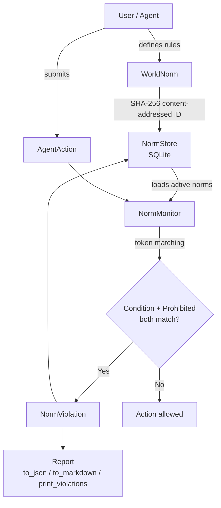

# Architecture

normsync is a pure-Python library implementing a world constitution engine for norm-governed multi-agent simulations and games.

## Module map

```
src/normsync/
├── norm.py        — Core data model (WorldNorm, AgentAction, NormViolation, NormRevision)
├── monitor.py     — NormMonitor: token-based norm checking engine
├── store.py       — NormStore: SQLite persistence layer
├── report.py      — Report formatters (JSON, Markdown, Rich table)
├── cli.py         — Click CLI (add, check, violations, revisions, status)
├── api.py         — FastAPI REST server (/norm, /norms, /check, /violations, /health)
└── mcp_server.py  — Model Context Protocol server (add_norm, check_action, list_violations)
```

## Data flow



## Key design decisions

### Content-addressed IDs

Every `WorldNorm` gets a deterministic 16-character hex ID derived from `SHA-256(name|condition|prohibited)`. This means:
- Two independently-defined norms with the same semantic meaning get the same ID
- IDs are stable across restarts and deployments
- No UUID generation or database auto-increment needed

The same pattern applies to `AgentAction` (keyed on `agent_id|action|location|timestamp`) and `NormViolation` (keyed on `norm_id|action_id`).

### Token-based matching (no regex)

Norm matching is intentionally simple: condition tokens must appear anywhere in the action's combined fields (action + location + target + faction), and the prohibited token must match the action verb. This is:
- Predictable — operators can reason about it without regex knowledge
- Fast — O(n*m) string scan with no compilation overhead
- Auditable — every match decision can be logged and explained

### SQLite as the single source of truth

`NormStore` uses SQLite for persistence. This enables:
- Zero-dependency deployment (SQLite ships with Python)
- File-based constitution that can be version-controlled
- In-memory mode (`:memory:`) for testing and ephemeral agents
- Multi-agent access via shared database file

### Layered architecture

The library is structured in layers with no upward dependencies:
1. `norm.py` — pure data model, no I/O
2. `monitor.py` — logic only, no persistence
3. `store.py` — persistence only, no business logic
4. `report.py` — formatting only
5. `cli.py`, `api.py`, `mcp_server.py` — integration layer, depends on all above

This makes each layer independently testable and replaceable.

### Optional heavy dependencies

FastAPI and the MCP SDK are optional extras (`pip install normsync[api]` or `normsync[mcp]`). The core library runs with only `click` and `rich` as dependencies. The API and MCP modules guard their imports at the top of each file and raise clear `ImportError` messages if the extras are missing.
