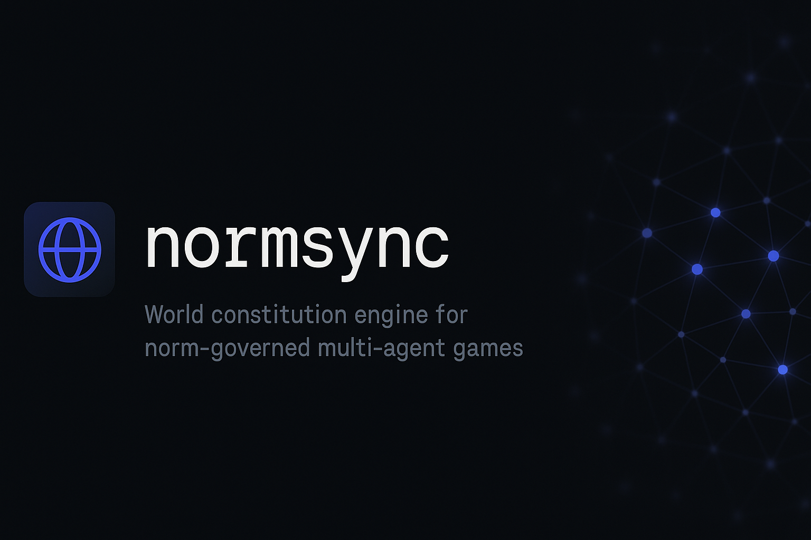
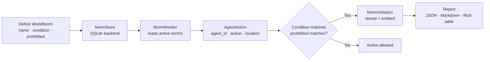

# normsync

**World constitution engine for norm-governed multi-agent games.**



[](https://github.com/sandeep-alluru/normsync/actions/workflows/ci.yml)
[](https://pypi.org/project/normsync/)
[](https://pypi.org/project/normsync/)
[](https://pypi.org/project/normsync/)
[](LICENSE)
[](https://codecov.io/gh/sandeep-alluru/normsync)
[](https://mypy-lang.org/)

[Quick Start](#quick-start) · [How It Works](#how-it-works) · [CLI Reference](#cli-reference) · [GitHub Action](#github-action) · [vs. Alternatives](#vs-alternatives) · [Contributing](CONTRIBUTING.md)

---

## Why

Multi-agent simulations and games need rules. But rules encoded in agent logic become invisible, hard to audit, and impossible to update without redeploying every agent.

normsync solves this by providing a **world constitution engine**: a centralized, content-addressed registry of normative rules that any agent can query. When an agent takes an action, normsync checks it against the active constitution and emits violations. Rules can be added, modified, or repealed at runtime without touching agent code.

```
normsync check agent1 attack safe_zone   # Fails if "attack in safe_zone" is prohibited
```

This is especially powerful in:
- **AI safety research**: enforce behavioral constraints in multi-agent simulations
- **Game design**: codify win conditions, prohibited actions, and faction rules
- **LLM agent governance**: define and monitor behavioral policies for AI agents
- **Compliance testing**: record which agent violated which rule and when

---

## How It Works



**Core primitives:**

- **WorldNorm** — a rule with a `condition` (when it applies) and a `prohibited` (what is forbidden). ID = SHA-256[:16] of `name|condition|prohibited`. Two agents defining the same rule always get the same ID.
- **AgentAction** — a timestamped action taken by an agent with `agent_id`, `action`, `location`, `target`, and `faction`.
- **NormViolation** — emitted when an action matches both the condition and prohibited token of an active norm.
- **NormRevision** — records when a norm is created, modified, or repealed.

Matching is token-based and case-insensitive: condition tokens must appear in the action's fields, and the prohibited token must match the action verb.

---

## Features

| Feature | Details |
|---------|---------|
| Content-addressed norms | SHA-256[:16] of name\|condition\|prohibited — same rule always same ID |
| Token-based matching | Case-insensitive, split on whitespace — no regex needed |
| Norm lifecycle | Add, repeal, and query active norms at runtime |
| SQLite persistence | Single file, no server required |
| In-memory mode | `NormStore(":memory:")` for testing and ephemeral sessions |
| REST API | `/norm`, `/norms`, `/check`, `/violations`, `/health` endpoints |
| MCP server | Model Context Protocol tools for Claude and other agents |
| CLI | `normsync add`, `check`, `violations`, `revisions`, `status` |
| JSON output | Machine-readable reports for downstream automation |
| Markdown output | Ready-to-paste GitHub PR comments |
| 46 tests | Comprehensive test suite covering all layers |

---

## Quick Start

```bash
pip install normsync
```

```python
from normsync import NormMonitor, NormStore, WorldNorm, AgentAction, print_violations

# Define world norms
monitor = NormMonitor()
monitor.add_norm(WorldNorm(
    name="no-attack-in-safe-zone",
    description="Attacking is prohibited in safe zones",
    condition="safe_zone",
    prohibited="attack",
))

# Check agent actions
action = AgentAction("hero", "attack", "safe_zone")
violations = monitor.check(action)

print_violations(violations)
# → Norm Violations table: hero | no-attack-in-safe-zone | ...

# Repeal a norm at runtime
monitor.repeal_norm(monitor.active_norms()[0].id)
```

---

## CLI Reference

```bash
normsync [--db PATH] COMMAND [OPTIONS]
```

| Command | Description | Key options |
|---------|-------------|-------------|
| `add NAME DESC CONDITION PROHIBITED` | Add a norm to the constitution | `--scope`, `--priority`, `--db` |
| `check AGENT_ID ACTION [LOCATION]` | Check an action against active norms | `--target`, `--faction`, `--db` |
| `violations` | List all recorded violations | `--format {table,json,markdown}`, `--db` |
| `revisions` | List norm revision history | `--db` |
| `status` | Show constitution summary | `--db` |

**Examples:**

```bash
# Add a norm
normsync add no-attack "No attacking in safe zones" safe_zone attack

# Check an action
normsync check hero attack safe_zone

# Export violations as JSON
normsync violations --format json

# Check constitution status
normsync status
```

---

## GitHub Action

Add normsync norm checks to your CI pipeline:

```yaml
# .github/workflows/normsync.yml
name: normsync constitution check
on: [push, pull_request]

jobs:
  norm-check:
    runs-on: ubuntu-latest
    steps:
      - uses: actions/checkout@v4
      - uses: sandeep-alluru/normsync@main
        with:
          db: .normsync/norms.db
          fail-on-violation: "true"
```

See [docs/github-action.md](docs/github-action.md) for full documentation.

---

## vs. Alternatives

| | normsync | OpenAI moderation | Constitutional AI | LangChain guardrails | Guardrails AI |
|---|---|---|---|---|---|
| **Norm-as-code** | Yes — version-controlled, content-addressed | No | No | No | No |
| **Runtime repeal** | Yes — deactivate without redeploying | No | No | No | No |
| **Multi-agent** | Yes — shared SQLite constitution | No | No | Limited | No |
| **Offline / local** | Yes — single SQLite file | No (API call) | No (training-time) | Partial | Partial |
| **CI exit code** | Yes — `normsync status --db` | No | No | No | No |
| **Primary purpose** | Agent norm enforcement | Content moderation | Model alignment | LLM output validation | Output validation |
| **Open source** | MIT | Closed | Closed | MIT | Apache 2.0 |

normsync is not a content moderation system. It is specifically designed to answer: *"Given these world norms, did this agent action violate any of them?"*

---

## Claude / MCP integration

normsync ships a Model Context Protocol server that lets Claude and other MCP-compatible agents define and check norms directly:

```bash
# Start the MCP server
python -m normsync.mcp_server

# In your Claude Code project's .claude/settings.json:
{
  "mcpServers": {
    "normsync": {
      "command": "python",
      "args": ["-m", "normsync.mcp_server"]
    }
  }
}
```

Once connected, Claude can call `normsync/add_norm`, `normsync/check_action`, and `normsync/list_violations` as tools. See [docs/mcp.md](docs/mcp.md) for the full tool schema.

---

## OpenAI integration

normsync exposes a FastAPI REST server compatible with OpenAI's function-calling format. The tool definitions are in [`tools/openai-tools.json`](tools/openai-tools.json) and the full API spec is in [`openapi.yaml`](openapi.yaml).

```bash
# Start the REST server
uvicorn normsync.api:app --reload

# Pass to Codex CLI or any OpenAI-compatible agent
codex --tools tools/openai-tools.json "Check which agent actions violated the world constitution"
```

Endpoints: `GET /health`, `POST /norm`, `GET /norms`, `POST /check`, `GET /violations`. See [docs/openai.md](docs/openai.md) for details.

---

## Repository structure

```
normsync/
├── src/
│   └── normsync/
│       ├── norm.py           # WorldNorm, AgentAction, NormViolation, NormRevision dataclasses
│       ├── monitor.py        # NormMonitor — token-based norm checking
│       ├── store.py          # NormStore — SQLite persistence
│       ├── report.py         # print_violations(), to_json(), to_markdown()
│       ├── cli.py            # Click CLI (add, check, violations, revisions, status)
│       ├── api.py            # FastAPI REST server
│       └── mcp_server.py     # MCP server
├── tests/
│   ├── test_norm.py          # WorldNorm, AgentAction, NormViolation, NormRevision tests
│   ├── test_monitor.py       # NormMonitor unit tests
│   ├── test_store.py         # NormStore SQLite tests
│   ├── test_report.py        # Report formatter tests
│   ├── test_cli_runner.py    # CLI integration tests
│   └── test_api.py           # FastAPI endpoint tests
├── examples/
│   └── demo.py               # Standalone demo script
├── docs/                     # MkDocs documentation
├── tools/
│   └── openai-tools.json     # OpenAI function-calling tool definitions
├── assets/
│   ├── hero.png              # README hero image
│   └── logo.png              # Project logo
├── action.yml                # GitHub Action
├── openapi.yaml              # OpenAPI 3.1 spec
├── pyproject.toml            # Package metadata + dependencies
└── CONTRIBUTING.md           # Contribution guide
```

---

## GitHub Topics

Suggested topics for discoverability:

`ai-agents` `governance` `norms` `ai-alignment` `sqlite` `mcp` `llmops` `multi-agent` `simulation` `norm-enforcement` `world-constitution` `python`

---

## Smithery

normsync is available as an MCP server on [Smithery](https://smithery.ai). Search for `normsync` to install it directly into your Claude Desktop or other MCP-compatible client.

---

[](https://star-history.com/#sandeep-alluru/normsync&Date)
